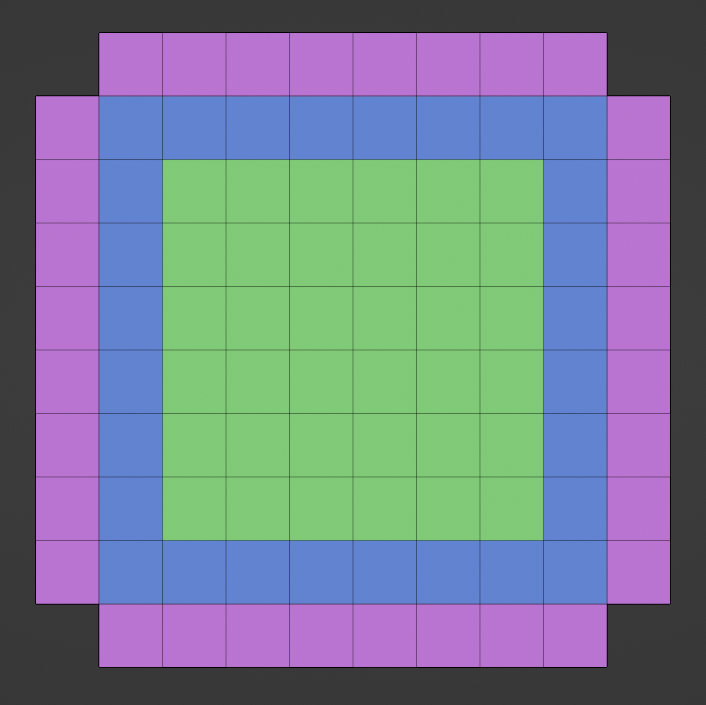
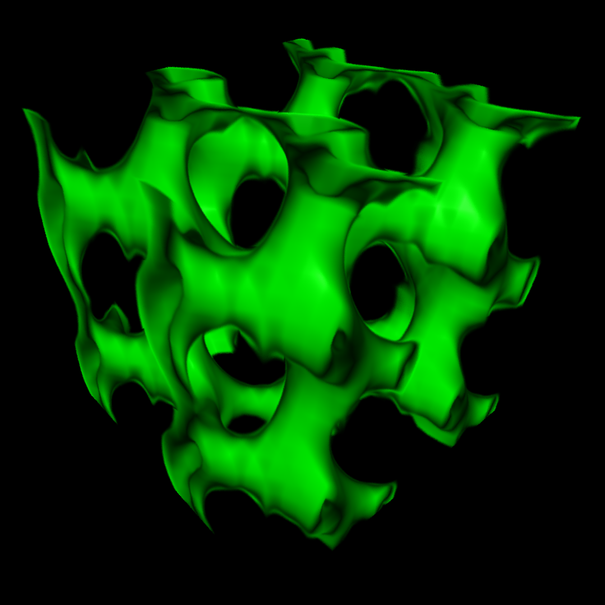
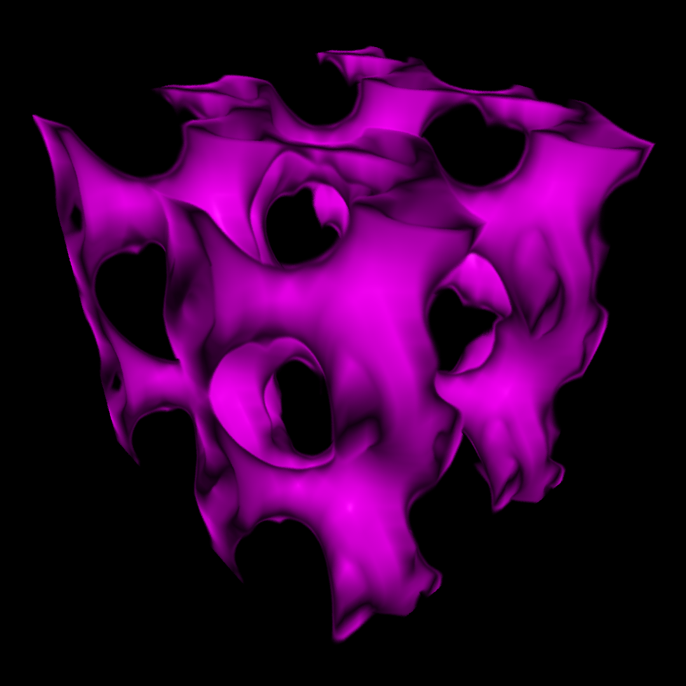

<!-- omit in toc -->
# Realtime simulation and visualization of FTLE fields on ABC flows
Scientific Visualization Project by Sai Prashanth Balachandran guided by Prof. Garth
<!-- omit in toc -->
## Table of Contents
- [Introduction](#introduction)
- [Prerequisites](#prerequisites)
- [Dependencies](#dependencies)
- [Getting started](#getting-started)
- [Controls](#controls)
- [The Grid](#the-grid)
- [Computing the FTLE values](#computing-the-ftle-values)
- [Volume Rendering](#volume-rendering)
- [Final Results](#final-results)
- [Conclusion](#conclusion)
- [References](#references)
- [Tutorials](#tutorials)

## Introduction
In this project, we compute the FTLE (Finite-Time Lyapunov Exponent) values for ABC (Arnold-Beltrami-Childress) flows and render them on the screen in real-time using CUDA (Compute Unified Device Architecture). Initially, the FTLE values are computed on a regular grid (aka uniform grid) using the parametric equations of ABC flows. And later, we render them on the screen using volume rendering techniques.

## Prerequisites
The prerequisites for setting up the project are as follows.
1. [Latest Nvidia GPU driver](https://www.nvidia.com/download/index.aspx)
2. [Nvidia Cuda Toolkit v12.3](https://developer.nvidia.com/cuda-toolkit)
3. [Visual Studio 2022](https://visualstudio.microsoft.com/downloads/) (with "Desktop development with C++" checked for MSVC, Clang and CMake)
4. [Visual Studio Code](https://code.visualstudio.com/download) (with C/C++ and CMake extensions) 
5. [CMake](https://cmake.org/download/) (v3.11 or higher)
6. [Git](https://git-scm.com/downloads)
7. [SourceTree](https://www.sourcetreeapp.com/) (Optional)
Download and install the above softwares.

## Dependencies
This project relies on the following open-source libraries, all of which are located within the "FTLE_Simulator/external" directory and have been appropriately configured in CMake to compile them.
1. [GLM](https://github.com/g-truc/glm)
2. [GLFW](https://www.glfw.org/)
3. [GLAD](https://glad.dav1d.de/)

## Getting started
Setting up the project involves the following steps.
1. After installing the prerequisites, clone this repository to the preferred directory of your choice using Git or SourceTree.
2. Open the "FTLE_Simulator" directory on Visual Studio Code. After opening, it should automatically configure the project.
3. Click on the Build button and choose MSVC as the default compiler for C++.
4. Once built, run main.exe inside the "FTLE_Simulator/build/debug" or "FTLE_Simulator/build/release" directory.

## Controls
After running the application, you will see a GLFW window on the screen.
1. Use the **W**, **A**, **S**, and **D** keys for navigation.
2. **Q** and **E** will move the camera up and down.
3. The **TAB** key will toggle between forward flow, backward flow, and Blended view consisting of both forward and backward flow.
4. Use the arrow keys **LEFT** and **RIGHT** to decrease and increase the integration duration.
5. Use the arrow keys **UP** and **DOWN** will change the integration start time.
6. Press **1** to toggle anti-aliasing on or off.
7. Press **2** to toggle lighting on or off.
8. To exit, press the **ESC** key.

## The Grid
The FTLE field is computed on a square regular grid as shown in the image below.

The above image illustrates a 2D grid with a resolution of 7, consisting of 6x6 cells. While only the green region is utilized for the final rendering, the purple and blue regions contain essential boundary points necessary for accurately computing FTLE values and normal vectors respectively via finite differences for every point within the green area.

The grid is translated such that its center lies at the origin. And at every point within the grid, we store the following data:
1. The position of the point, which includes its initial and current position at time t for both forward and backward flows.
2. Indices of neighboring points for efficiently computing the finite differences.
3. FTLE values for both forward and backward flows.
4. Normal vectors at the point's position.

Additionally, we calculate the axis-aligned bounding box of the grid, consisting of the boundaries of the green region utilized for rendering. Subsequently, the grid points are flattened and stored in a 1D array within the GPU memory for further processing.

## Computing the FTLE values
To compute the FTLE values, we follow these steps:
1. For a given starting time and integration duration, integrate the current position of all the points both forward and backwards in time using the RK4 integration scheme using the ordinary difference equation (ODE) for ABC flows, as detailed in [1].
2. Once the points have been integrated both forward and backward in time, we compute the flow map Jacobian matrix based on the initial and current positions of the points using finite differences. At this stage, the points in the purple region are no longer utilized.
3. From the Jacobian matrix, we can compute the Flow map tensor (aka Cauchy-Green deformation tensor) by multiplying the flow map Jacobin matrix with its transpose.
4. We then use CuSolver to compute the singular values associated with the Flow map tensor matrix which represents the magnitude of divergence.
5. Finally, the FTLE field values are computed by normalizing and scaling the singular values logarithmically.

Similarly, to calculate the normal vectors at each point, we utilize finite difference approximation, employing the FTLE values of neighboring points. After this step, the boundary points in the blue region are not useful anymore.

All grid points within the green region are now updated with the correct FTLE values and normal vectors, ready for the final rendering process.

## Volume Rendering
A single point light source, located at the camera's position, is used for illumination, and it moves along with the camera. This approach will facilitate real-time frame rendering.

Volume rendering is executed through the following steps:
1. We cast rays for each pixel of the viewport and conduct intersection tests with the axis-aligned bounding box of the grid.
2. If the ray intersects the bounding box, we perform ray-marching through the volume at fixed step size along with some noise if anti-aliasing is enabled.
3. At each point along the ray, trilinear interpolation is applied to interpolate the FTLE values and the normal vectors.
4. Utilizing the interpolated FTLE values, we compute the color and opacity at that point using the transfer function.
5. We then use this color along with the interpolated normal vectors to shade the point based on the Phong lighting model. Since this is a volume we consider both sides of the normal vectors to compute lighting.
6. Forward compositing (over blend) is then carried out to blend the colors according to the opacity values.
7. The resulting pixels are passed to the texture object of OpenGL and displayed on the screen within a GLFW window.

We can also cast more rays and average the result by enabling anti-aliasing in Settings.cpp file but this could reduce the performance significantly.

Note: We have not added attenuation of radiance while computing Phong lighting to maintain uniform lighting for visualization purposes. Also, we are considering both sides of the normal vector to compute lighting since its a volume.

## Final Results
Below are sample images rendered using a GTX 1050Ti Max-Q:

Forward flow:

Backward flow:

Blended flow (Forward and Backward):

## Conclusion
In conclusion, we have successfully achieved the real-time computation and visualization of FTLE (Finite-Time Lyapunov Exponent) fields for ABC (Arnold-Beltrami-Childress) flows by harnessing the computational power of modern GPU through CUDA from scratch.

## References
[1]. [MCFTLE: Monte Carlo Rendering of Finite-Time Lyapunov Exponent Fields](https://onlinelibrary.wiley.com/doi/full/10.1111/cgf.12914)

[2]. Computer Graphics and Scientific Visualization course materials by Prof. Garth

## Tutorials
1. [Introduction to CUDA](https://developer.nvidia.com/blog/easy-introduction-cuda-c-and-c)
2. [Optix 7 Course](https://github.com/ingowald/optix7course)
3. [OpenGL Course](https://learnopengl.com)
4. [CuSolver documentation](https://docs.nvidia.com/cuda/cusolver)
5. [CuSolver examples](https://github.com/NVIDIA/CUDALibrarySamples/blob/master/cuSOLVER)
6. [CMake Tutorial](https://cmake.org/cmake/help/latest/guide/tutorial/index.html)
